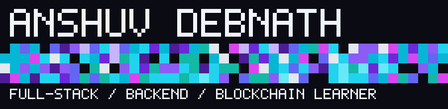

  

  &nbsp;
  &nbsp;
  &nbsp;
  &nbsp;
  &nbsp;
  

---

Hey there! 👋 I'm **Anshuv Debnath**, a 2nd-year B.Tech Computer Science & Engineering student based in **Kolkata, India**. 

I am an enthusiastic full-stack and backend developer with an obsession for resilient system architectures, clean code, and intuitive developer experiences. Currently, I'm diving headfirst into decentralized systems, exploring blockchain primitives and smart contracts to build verifiable, tamper-proof applications.

---

- 💻 **Full-Stack Development:** Architecting end-to-end web applications primarily using the **MERN** stack (MongoDB, Express, React, Node.js) paired with modern component-driven frontends.
- ⚙️ **Backend & APIs:** Designing RESTful services, telemetry pipelines, and database schemas built for stability and low latency.
- ⚡ **Competitive Hackathons:** Rapidly prototyping real-world solutions under tight sprint deadlines (such as *HimVigil*, a community hazard telemetry system for Himalayan avalanches & GLOFs).
- ⛓️ **Web3 Exploration:** Studying Ethereum Virtual Machine (EVM) fundamentals, Solidity smart contracts, and decentralized data structures.

---

> *"To engineer high-impact software systems that bridge robust distributed backends with verifiable, trustless decentralized protocols — building software that solves complex real-world challenges with cryptographic transparency, speed, and uncompromising reliability."*

---

When I'm not in my IDE debugging routes or writing algorithms:
- 🚀 **Hackathons & Ideation:** Brainstorming and sprinting on prototype apps at tech competitions.
- 📚 **Tech Deep Dives:** Exploring systems internals, operating system mechanics, and Web3 consensus algorithms.
- 🕹️ **Pixel Art & Retro Games:** Appreciating minimalist retro game design, cyberpunk themes, and neon aesthetics.
- 🤝 **Community & Peer Learning:** Collaborating with fellow builders, sharing dev insights, and pair-programming.

---

  

---

  

---

  

---

### 💬 Interactive Community Guestbook

Visited my profile? Leave your mark on my README wall! Click the badge below to write a quick note—a GitHub Action will automatically add your greeting to this board.

  

<table width="100%">
<!-- GUESTBOOK_ENTRIES_START -->
<tr><td></td><td><strong><a href="https://github.com/anshuvdebnath-cyber">@anshuvdebnath-cyber</a></strong>: <em>Welcome to my profile! Feel free to sign the guestbook above. 🚀</em></td><td align="right"><code>2026-10-05</code></td></tr>
<!-- GUESTBOOK_ENTRIES_END -->
</table>

---

<table width="100%">
  <tr>
    <td width="50%" valign="top">
      <h4><a href="https://github.com/anshuvdebnath-cyber/HACKRIT-HACKATHON-2026">🏔️ HimVigil (HACKRIT-HACKATHON-2026)</a></h4>
      
Himalayan hazard index & offline-ready alerting prototype for avalanches, flash floods, and GLOF risk awareness with live meteorological and DEM relief telemetry.

      <code>React</code> &bull; <code>Node.js</code> &bull; <code>FastAPI</code> &bull; <code>DEM Data</code>
    </td>
    <td width="50%" valign="top">
      <h4><a href="https://github.com/anshuvdebnath-cyber/HACK-SYNTHESIS-3.0">⚡ HACK-SYNTHESIS-3.0</a></h4>
      
Full-stack hackathon project engineered for rapid responsiveness and high-throughput data processing.

      <code>JavaScript</code> &bull; <code>Express</code> &bull; <code>MongoDB</code>
    </td>
  </tr>
  <tr>
    <td width="50%" valign="top">
      <h4><a href="https://github.com/anshuvdebnath-cyber/hackathon-tracker">🎯 Hackathon Tracker</a></h4>
      
Comprehensive dashboard and workflow manager for tracking hackathon milestones, team submissions, and deliverables.

      <code>React</code> &bull; <code>Tailwind</code> &bull; <code>Vite</code>
    </td>
    <td width="50%" valign="top">
      <h4><a href="https://github.com/anshuvdebnath-cyber/HABIT-TRACKER-PROTOTYPE">📊 Habit Tracker Prototype</a></h4>
      
A personal productivity prototype designed to cultivate consistency with streak metrics and analytics.

      <code>JavaScript</code> &bull; <code>CSS3</code> &bull; <code>HTML5</code>
    </td>
  </tr>
  <tr>
    <td width="50%" valign="top">
      <h4><a href="https://github.com/anshuvdebnath-cyber/replica-rush-web-redesign-2025">🎨 Replica Rush Redesign</a></h4>
      
Modern responsive frontend redesign emphasizing dynamic visual interactions and clean UI architecture.

      <code>CSS Grid</code> &bull; <code>Modern UI</code> &bull; <code>JavaScript</code>
    </td>
    <td width="50%" valign="top">
      <h4><a href="https://github.com/anshuvdebnath-cyber/backend_programs">🛠️ Backend Programs</a></h4>
      
Collection of robust server-side algorithms, data modeling practices, and RESTful API architecture drills.

      <code>Node.js</code> &bull; <code>C++</code> &bull; <code>OOP</code>
    </td>
  </tr>
</table>

  

